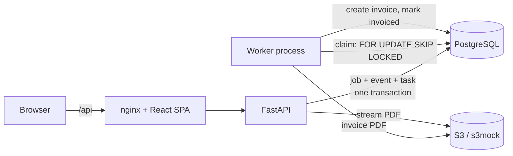

# Tamago

A small dispatch and invoicing app for logistics and field-service work: create a job, assign a driver, move it through delivery, and get an invoice PDF generated automatically when it's completed.

It's a deliberately compact, end-to-end example of a full-stack, event-driven service:

- **Backend:** Python, FastAPI, SQLAlchemy 2, Alembic, PostgreSQL 16
- **Async work:** a database-backed task queue and a separate worker process (transactional outbox, `FOR UPDATE SKIP LOCKED`, retries with backoff)
- **Storage:** S3-compatible object storage for invoice PDFs (`boto3`; `adobe/s3mock` locally, real S3 by configuration)
- **Frontend:** React 19, TypeScript, Vite, Tailwind v4, shadcn/ui, TanStack Query, linted with `@shadcn/lint`
- **Delivery:** Docker Compose for the whole stack, GitHub Actions CI

Screens were designed first in Pencil (`docs/design/tamago.pen`, PNGs in `docs/design/screens/`), then built from that design. The spec is in [`docs/SPEC.md`](docs/SPEC.md).

## Architecture



### The job lifecycle

`created → dispatched → in_transit → completed → invoiced`

- The API drives the first four transitions. Skipping a step returns `409`.
- `invoiced` is set only by the worker, never by a client.
- Every transition writes a `job_events` row (the timeline in the UI) and a `job.status_changed` task **in the same database transaction**. There is no window where a job changes state and the event is lost, or an event exists for a change that rolled back.

### The queue

| Concern | Approach |
| --- | --- |
| Producing events | Transactional outbox: the task row is inserted with the state change. |
| Claiming work | `SELECT … FOR UPDATE SKIP LOCKED LIMIT 1`, then mark `running`. Concurrent workers never take the same task. |
| Delivery guarantee | At-least-once. Handlers are idempotent (the invoice handler locks the job row and checks for an existing invoice, so running it repeatedly yields one invoice). |
| Failures | Exponential backoff (5s, 10s, 20s … capped at 5 min), then `failed` after `max_attempts` with the last error kept. |
| Crashed workers | A reaper returns tasks stuck in `running` past a lock timeout to the queue. |

A queue in Postgres is a deliberate choice at this scale: no extra infrastructure, and the queue shares a transaction with the data. The natural next step (SQS, Kafka) would keep the same outbox and handler contract.

## Run it

Everything in Docker:

```
make up            # docker compose up -d --build
make seed          # optional demo data via the API
```

- App: http://localhost:8080
- API docs: http://localhost:8390/docs
- Postgres on `localhost:5442`, S3 mock on `localhost:9090`

### Local development

```
docker compose up -d db s3
python3 -m venv .venv && .venv/bin/pip install -e "backend[dev]"
cd backend && ../.venv/bin/alembic upgrade head
../.venv/bin/uvicorn app.main:app --port 8390     # API
../.venv/bin/python -m app.worker                 # worker (separate process)

cd frontend && npm install && npm run dev         # http://localhost:5180
```

## Tests and checks

```
make test          # pytest (24 tests: lifecycle, queue, retry, idempotency, S3) and vitest
make lint          # ruff, tsc, oxlint (with @shadcn/lint)
```

Backend tests run against a real PostgreSQL (`tamago_test`) and refuse to run against any database whose name doesn't end in `_test`. CI runs the same checks, plus `alembic upgrade` / `check` / `downgrade` to confirm migrations match the models, and builds the Docker images.

## Deploying

[`docs/DEPLOY.md`](docs/DEPLOY.md) covers a VPS deployment with Dokploy, Cloudflare R2 for invoice storage, and Cloudflare Access in front. It uses `docker-compose.prod.yml`, which publishes no ports. [`docs/AWS.md`](docs/AWS.md) describes how it would map onto AWS.

## Design-system linting

`@shadcn/lint` runs through Oxlint with three rules on: `no-arbitrary-values`, `no-restyle` (layout classes only on shadcn components), and `no-raw-colors`. Status colours are theme tokens (`--status-*`) defined in the design file and mirrored in `frontend/src/index.css`.

## How it was built

Built in reviewed phases (backend, queue and worker, screens, frontend, delivery) with an AI coding agent doing the implementation against the spec. Each phase was verified with tests, real processes and screenshots of the running UI before moving on.

## Known limitations

- Auth is a single optional API key; there are no users or roles.
- The UI polls for updates instead of using push (SSE/WebSockets).
- Lists aren't paginated.
- Local infrastructure only: it uses the same `boto3` code path as AWS S3, but there is no AWS deployment or IaC yet. [`docs/AWS.md`](docs/AWS.md) describes how it would run on AWS.
