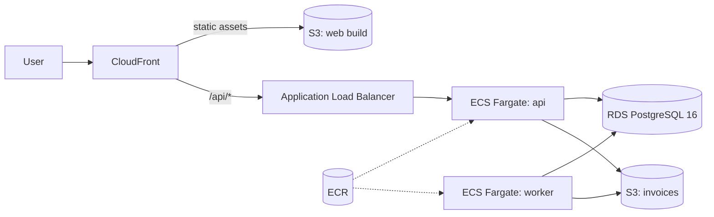

# Running Tamago on AWS

**Status: design notes only. Nothing here has been deployed or applied.** The application is verified locally (Docker Compose, CI). The one code change made for AWS is that the storage layer now uses boto3's default credential chain when `TAMAGO_S3_ENDPOINT` is empty, which is checked to resolve to the real regional S3 endpoint.

## Target architecture



| Local | AWS | Notes |
| --- | --- | --- |
| `db` (postgres:16) | RDS for PostgreSQL 16 | Private subnets, Multi-AZ for production, automated backups. Credentials in Secrets Manager. |
| `s3` (adobe/s3mock) | S3 bucket | Block Public Access on, SSE-S3 (or KMS), versioning on. Code is unchanged: leave `TAMAGO_S3_ENDPOINT` empty. |
| `api` | ECS Fargate service behind an ALB | Health check on `/health`. Two tasks across two AZs. |
| `worker` | ECS Fargate service, no load balancer | Safe to run several: claims use `FOR UPDATE SKIP LOCKED`. |
| `migrate` | One-off ECS task run before each deploy | `alembic upgrade head`; deploy stops if it fails. |
| `web` (nginx) | S3 bucket + CloudFront | `/api/*` behaviour forwards to the ALB, mirroring the nginx proxy. |
| Compose logs | CloudWatch Logs | `awslogs` driver on each task. |

## Configuration

The app reads everything from environment variables (`TAMAGO_` prefix), so the same image runs unchanged:

| Variable | Value on AWS |
| --- | --- |
| `TAMAGO_DATABASE_URL` | `postgresql+psycopg://…@<rds-endpoint>:5432/tamago`, injected from Secrets Manager |
| `TAMAGO_S3_ENDPOINT` | empty (uses real S3) |
| `TAMAGO_S3_BUCKET` | invoice bucket name |
| `TAMAGO_S3_REGION` | e.g. `eu-west-2` |
| `TAMAGO_API_KEY` | from Secrets Manager (see Security) |

**Credentials:** no access keys. The api and worker tasks get an IAM task role limited to the invoice bucket:

```json
{
  "Effect": "Allow",
  "Action": ["s3:PutObject", "s3:GetObject"],
  "Resource": "arn:aws:s3:::<invoice-bucket>/invoices/*"
}
```

The bucket is created up front by IaC. The app's "create bucket if missing" fallback should be treated as a local-development convenience and not relied on (the role above deliberately can't create buckets).

## Deploy sequence

1. CI builds the `backend` and `frontend` images (already done by `docker compose build` in CI) and pushes them to ECR, tagged with the commit SHA.
2. Run the `migrate` task with the new image. Abort on non-zero exit.
3. Update the `api` and `worker` services (rolling deploy, minimum healthy percent 100).
4. Upload the frontend build to the web bucket and invalidate the CloudFront cache.

Migrations should stay backwards-compatible with the previous release (add-only, then clean up in a later release), because old tasks keep running during the rollout. The project's migrations are already additive.

## What changes at scale

- **Worker scaling:** autoscale the worker service on the number of pending tasks. A small scheduled job (or the worker itself) can publish `COUNT(*) WHERE status='pending'` as a CloudWatch metric.
- **Alerting:** alarm on tasks in `failed` and on the age of the oldest `pending` task. These are the two ways the queue can silently stop being useful.
- **Serving PDFs:** the API currently streams invoices from S3. In production, return a short-lived presigned URL instead so downloads bypass the API.
- **Database connections:** each api and worker task holds its own pool. If task counts grow, add RDS Proxy or lower the pool sizes.
- **Queue evolution:** if throughput or fan-out outgrows a Postgres queue, publish the same outbox rows to SQS (or Kafka) from a relay process. Producers and handlers keep their current contract: an event exists if and only if the state change committed, and handlers are idempotent.

## Security

- API and worker run in private subnets; only the ALB is public, terminating TLS with an ACM certificate.
- RDS is reachable only from the ECS security group.
- The single shared API key is fine for a demo but not for production: put the API behind Cognito (or another OIDC provider) with per-user auth, and keep the key only for service-to-service calls.
- Container images run as a non-root user (already the case).

## Not done

No Terraform/CDK, no account, no measured cost or performance numbers. If this moved forward, the first artifact would be the IaC for the VPC, RDS, S3 buckets, ECS services and IAM roles, verified with `plan` before any apply.
